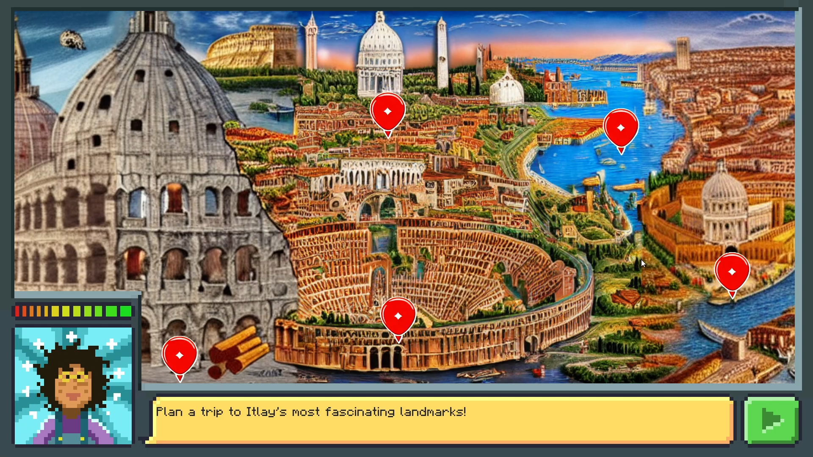
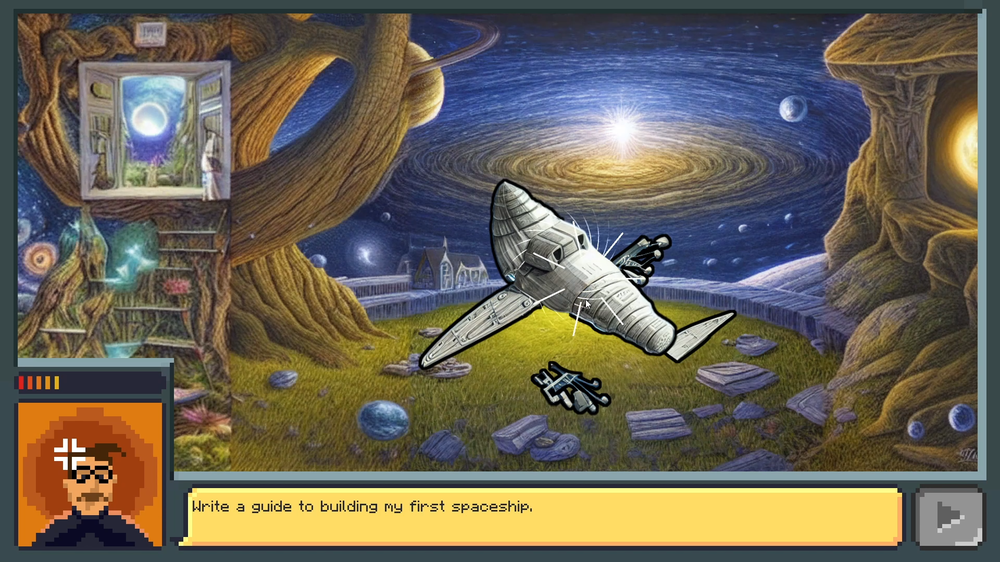
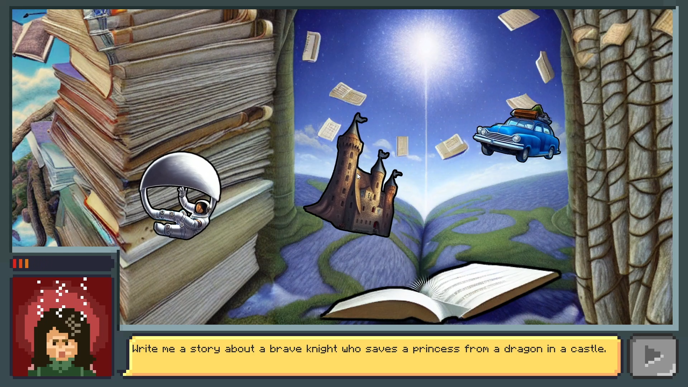

# POV: GPT
A minigame made as part of the Minigames 2023 course at Bezalel Academy of Art and Design. 
In this game you play as an AI chatbot that needs to answer people's requests before they lose their patience.

Pixel art by me, the rest was done with [Stable Diffusion](https://stability.ai/) and [AUTOMATIC1111's web UI](https://github.com/AUTOMATIC1111/stable-diffusion-webui).

[Game on itch.io](https://orkachlon.itch.io/pov-gpt) 
[Trailer on Vimeo](https://vimeo.com/806103902)

### Implementation
The game was made in Unity, using Visual Scripting almost exclusively.

### Screenshots

